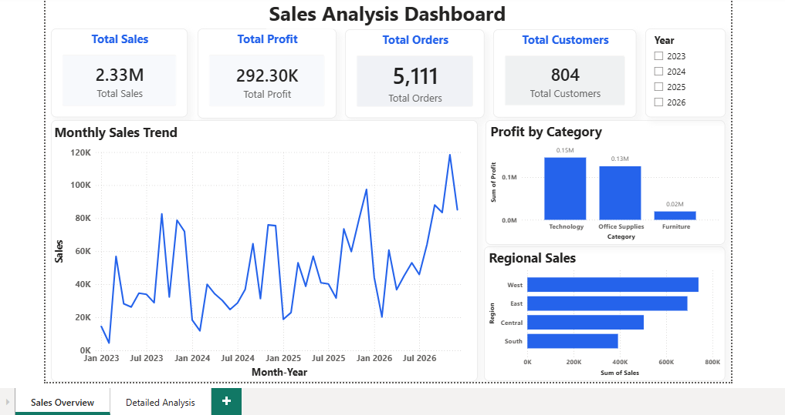
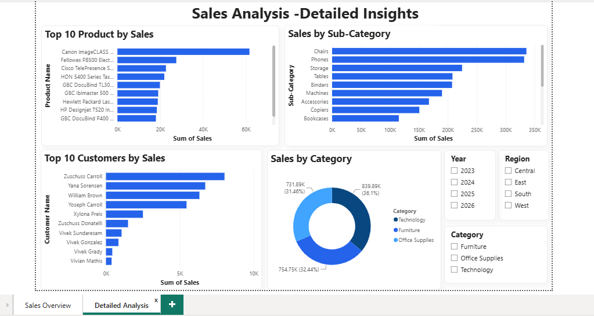

# 📊 Sales Analysis Dashboard

## 📌 Project Overview

This project analyzes sales data using **MySQL**, **SQL**, and **Power BI** to uncover business insights related to revenue, profit, customer behavior, product performance, and regional sales.

The dashboard provides an interactive view of key performance indicators (KPIs) and helps identify trends and top-performing products and customers.

---

## 🛠️ Tools & Technologies Used

- MySQL
- SQL
- Power BI
- Microsoft Excel / CSV Dataset

---

## 📂 Project Structure

```text
sales-analysis-dashboard/
│
├── dashboard/
│   └── Sales_Analysis.pbix
│
├── dataset/
│   └── sales_data.csv
│
├── python/
│   └── import_csv_to_mysql.py
│
├── screenshots/
│   ├── sales_overview.png
│   └── detailed_analysis.png
│
├── sql/
│   ├── sql_queries.sql
│   └── sql_practice.sql
│
└── README.md
```

---

## 🚀 How to Run

1. Install the required Python libraries:

```bash
pip install pandas sqlalchemy pymysql
```

2. Update the MySQL credentials in `Python/import_csv_to_mysql.py`.

3. Ensure MySQL Server is running and create a database named `sales_analysis`.

4. Run:

```bash
python Python/import_csv_to_mysql.py
```

5. Open `Sales_Analysis_Dashboard.pbix` in Power BI Desktop.

---

## 📈 Dashboard Features

### Sales Overview

- Total Sales KPI
- Total Profit KPI
- Total Orders KPI
- Total Customers KPI
- Monthly Sales Trend
- Profit by Category
- Regional Sales Analysis
- Interactive Year Slicer

### Detailed Analysis

- Top 10 Products by Sales
- Top 10 Customers by Sales
- Sales by Sub-Category
- Sales by Category Distribution
- Interactive Year, Region, and Category Slicers

---

## 🗄️ SQL Analysis Performed

- Revenue Analysis
- Profit Analysis
- Regional Sales Analysis
- Category-wise Profit Analysis
- Top Products Analysis
- Top Customers Analysis
- Monthly Sales Trend Analysis
- Discount Analysis
- Aggregate Functions
- GROUP BY & HAVING
- CASE Statements
- Subqueries
- Common Table Expressions (CTEs)
- Window Functions (RANK, DENSE_RANK, ROW_NUMBER)
- LAG Function for Year-over-Year Comparison

---

## 📊 Key Insights

- The West region generated the highest sales.
- Technology was the most profitable category.
- Monthly sales showed an overall upward trend.
- A small number of products contributed significantly to total revenue.
- Top customers accounted for a substantial share of overall sales.

---

## 📊 Dashboard Preview

### Sales Overview



### Detailed Analysis



---

## 🚀 Future Improvements

- Add forecasting using Power BI.
- Build DAX measures for advanced KPIs.
- Include profit margin and growth metrics.
- Publish the dashboard to the Power BI Service.

---

## 👩‍💻 Author

**Sushma Sakry**

Developed as an end-to-end portfolio project to demonstrate practical skills in MySQL, SQL, Python, and Power BI for business data analysis and interactive dashboard development.
